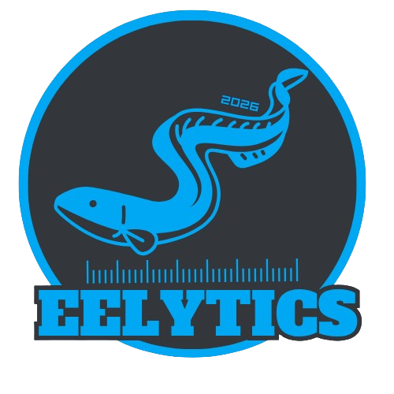
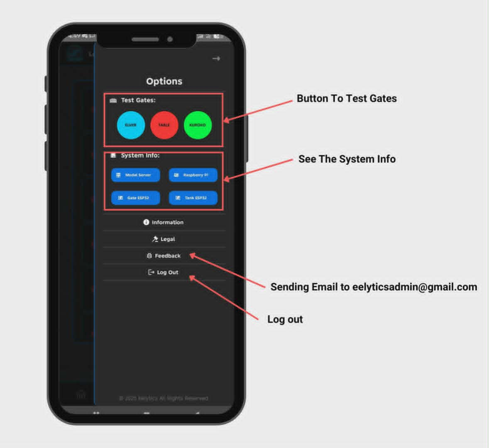
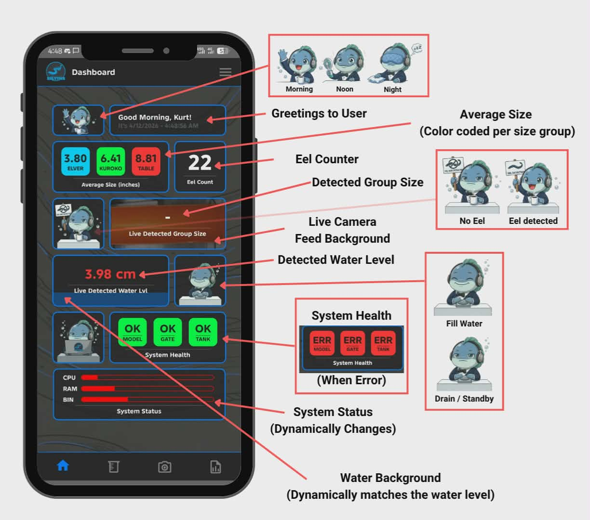
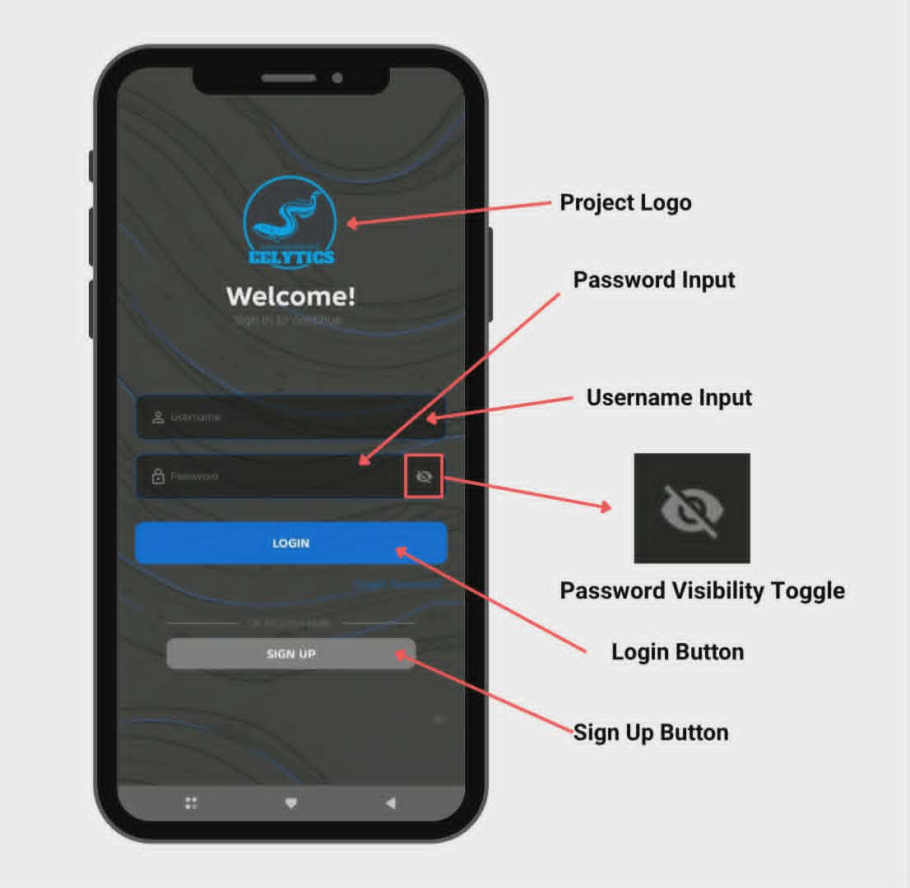
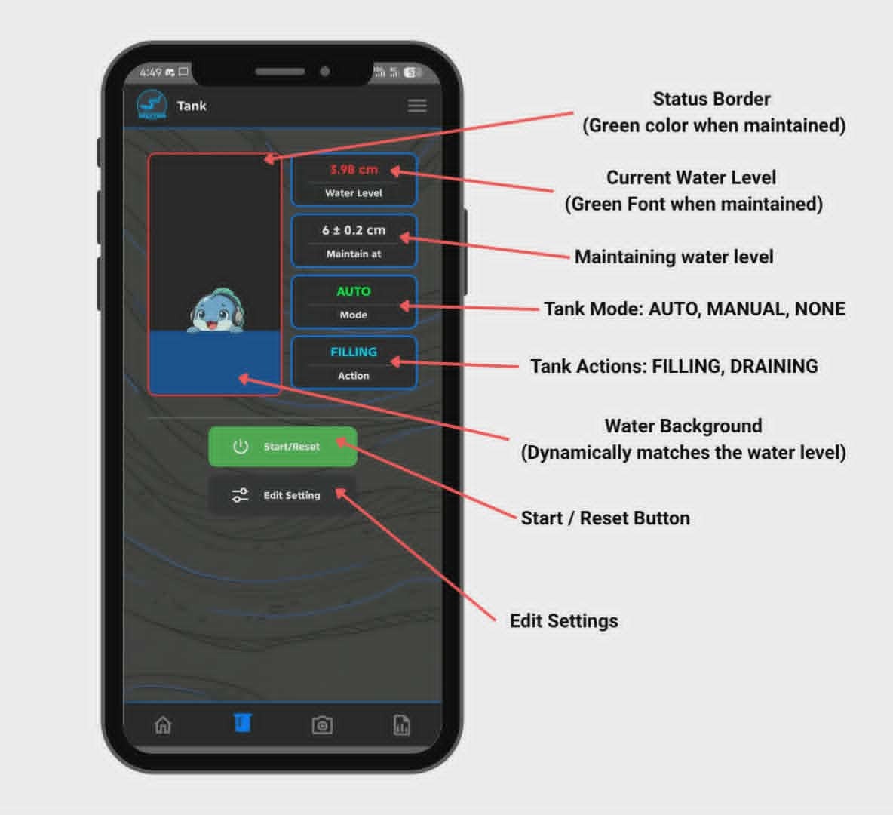
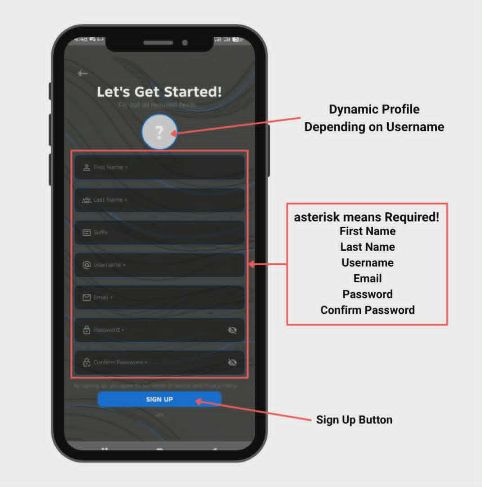
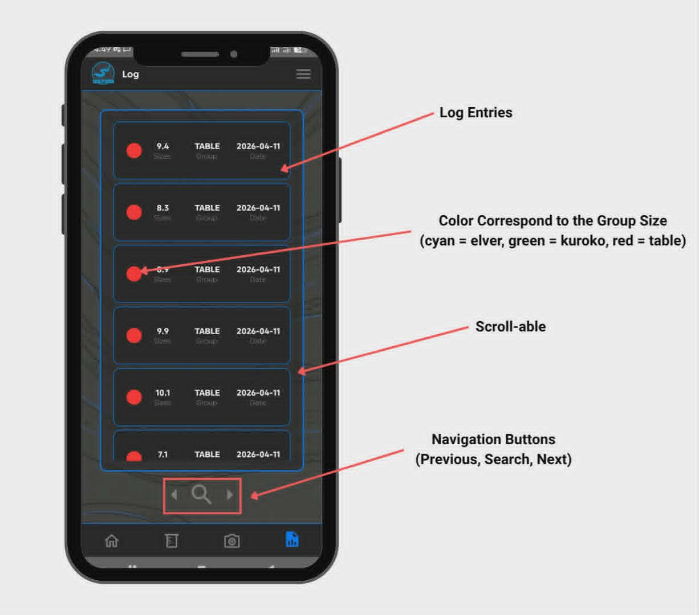

# Eelytics Mobile App

<div align="center">
  

  <h3>Automated Vision-Based Eel Segregation System</h3>
  <p><i>An intelligent mobile interface for real-time monitoring, analytics, and regulatory compliance.</i></p>

  ---
</div>

### Project Overview

**Project Eelytics** is developed to ease the intensive manual labor of sizing and grading live eels. This application acts as the primary operator control center and data visualization portal, ensuring strict alignment and compliance with the **Bureau of Fisheries and Aquatic Resources (BFAR) Fisheries Administrative Order (FAO) No. 242** regulations governing juvenile eel trade and exportation.

By interfacing directly with an integrated computer vision backend powered by a **Mask R-CNN** model, the system tracks real-time size metrics, handles batch states, and optimizes automated sorting mechanisms seamlessly.

## Repository Directory Tree

```text
eelytics-app-v2/
├── .expo/                # Expo development build cache
├── android/              # Native Android build configurations
├── assets/               # Local static images, graphics, and system icons
├── components/           # Reusable UI widgets and sub-modules
├── pages/                # Flat modular top-level screen views
├── App.js                # Main application entry point & root state provider
├── app.json              # Expo configuration file (metadata, splash screens)
├── eas.json              # Expo Application Services build profiles
├── index.js              # Native registry entry point
├── package.json          # Project dependencies, scripts, and versions
└── README.md             # Project documentation (this file)
```

## Modular Core Components (`components/`)

The application enforces strict design reuse across its interfaces. Below is the technical API and description of each reusable component within `src/components/`.

### 1. `AnimateIcon.js`
A visual-feedback wrapper component that uses the native animation driver to provide a spring-loaded micro-interaction when a navigation element or screen focus changes.

* **How it works:** It utilizes `Animated.spring` to smoothly shift the target child element upwards along the Y-axis by `-3` pixels when active.
* **Props Matrix:**
  | Prop Name | Type | Description |
  | :--- | :--- | :--- |
  | `focused` | `Boolean` | Controls the target spring state (`true` to lift up, `false` to reset). |
  | `children` | `ReactNode` | The icon or image asset layout getting wrapped by the spring view. |

---

### 2. `GeneralModal.js`
A standardized modal window featuring a semi-transparent dark overlay background (`rgba(30,30,30,0.5)`) and a signature neon blue border accent (`#007AFF`).

* **How it works:** Provides flexible layout injection used primarily to anchor large administrative panels such as the legal requirements list or system information cards dynamically over the viewport.
* **Props Matrix:**
  | Prop Name | Type | Description |
  | :--- | :--- | :--- |
  | `state` | `Boolean` | Visibility toggler passing directly into the native `Modal` component. |
  | `children` | `ReactNode` | The custom internal views or text nodes rendered within the card frame. |
  | `onClose` | `Function` | Callback trigger when the user requests an explicit exit dismiss action. |
  | `height` / `width` | `String \| Number` | Custom sizing bounds to adapt to differing data page presentation shapes. |

---

### 3. `Header.js`
The consistent header shell tracking across all major platform views, establishing global branding identity.

* **How it works:** Renders the application logo asset alongside the contextual page name, exposing an effortless interface connection to standard menu toggles.
* **Props Matrix:**
  | Prop Name | Type | Description |
  | :--- | :--- | :--- |
  | `title` | `String` | Text content rendered inside the header area (e.g., "Dashboard", "Logs"). |
  | `seeMenu` | `Function` | Callback hooked into a trailing `MaterialCommunityIcons` menu button to slide open parameters. |

---

### 4. `InputField.js` & `PasswordField.js`
Form fields designed for credential intake with uniform styles, flat-shaded dark backgrounds, and neon highlight boundaries.

* **How it works:** Both expose full `TextInput` mappings. `PasswordField` appends a specialized visibility eye icon switcher utilizing a boolean layout tracker.
* **Key Parameter Targets:**
  * Auto-capitalization is explicitly disabled (`none`) alongside auto-correct flags (`false`) to ensure standard authentication tokens are captured predictably.
  * Inputs are bound to custom callback modifiers via `onChangeText`.

---

### 5. `PopUp.js`
A critical system status feedback portal used to catch operational errors, validation confirmations, or display inline machine states.

* **How it works:** It maps a status string parameter directly to custom state styles, assets, and colors:
  * 🟢 **`success`** (`#4CAF50`): Confirms successful batch entries or state commits.
  * 🔴 **`error`** (`#FF5252`): Signals network issues or hardware misalignments.
  * 🟡 **`warning`** (`#FFC107`): Signals threshold alerts.
  * 🔵 **`loading`** (`#007AFF`): Shows an inline `ActivityIndicator` spinner during async operations.

---

### 6. `SettingMenu.js`
The primary administration panel that houses hardware diagnostics, manual overrides, and references. It coordinates both nested internal sub-modals and status hooks.

* **Key Integrated Systems:**
  1. **Test Gates Overrides:** Direct manual trigger configurations supporting live sizing groups under FAO No. 242 protocols:
     * `ELVER` Gate Check (`#00D4FF`)
     * `TABLE` Gate Check (`#FF3131`)
     * `KUROKO` Gate Check (`#00FF41`)
  2. **System Diagnostics Core Links:** Integrated trigger buttons targeting edge nodes:
     * `Model Server` (Mask R-CNN machine status query)
     * `Raspberry Pi` (Central processing bridge)
     * `Gate ESP32` / `Tank ESP32` (Actuator and sensor microcontroller checks)
  3. **Operational Controls:** Handlers built to bind direct system feedback email sequences via `Linking` alongside transactional logout routines via navigation wrappers (`navigation.replace('Login')`).

<div align="center">
  
</div>

## Application Presentation Layer (`pages/`)

The application layer contains the high-level views that orchestrate UI updates, poll data streams from the edge nodes, and handle hardware overrides.

### 1. `Home.js`

Acts as the foundational layout shell and tab navigator manager. It wraps the core system views with structural safety areas, consistent brand identity, and smooth animation hooks.

* **Core Mechanics:**
  * Uses a `@react-navigation/material-top-tabs` navigator rendered along the screen bottom to swap active child windows.
  * Listens dynamically to route modifications via `screenListeners` to supply the parent `Header` title with contextual updates.
  * Leverages your modular `<AnimateIcon>` wrapper to apply micro-animations to active navigation icons.
* **Navigation Tree Routes:**
  | Route Target | Rendered Page component | Route Strategy / Route Parameters |
  | :--- | :--- | :--- |
  | `Dashboard` | `Dashboard.js` | Receives global network mappings (`baseUrl`, `firstName`). |
  | `Tank` | `Tank.js` | Receives API control parameter mappings (`baseUrl`). |
  | `Live` | `Live.js` | Connects directly to the system video streams (`baseUrl`). |
  | `Log` | `Log.js` | Interfaces with remote databasing queries (`baseUrl`). |

---

### 2. `Dashboard.js`

Serves as the mission control panel. It polls real-time metrics across distinct edge APIs, updating the state every 100ms to keep operators up to date with sorting operations.

* **Core Operational Modules:**
  * **Greeting Matrix:** Analyzes localized temporal values via `getHours()` to establish contextual time bounds (Morning, Noon, Afternoon, Evening) and switch background banners accordingly.
  * **Average Sizing Feed:** Long-polls data from `${baseUrl}/api/eelsdb/get_data` to render average dimensional scales (in inches) broken down by legal classifications (**ELVER**, **KUROKO**, **TABLE**).
  * **Video Integration:** Hosts an optimization-configured `WebView` targeting `${baseUrl}/cam/` to present the physical sorting environment directly on the main desk view.
  * **Animated Volumetric Gauge:** Linearly interpolates digital level feedback derived from the tank server into direct layout height transformations (`0cm` to `15cm` mapped smoothly across `0%` to `100%`).

<div align="center">
  
</div>

---

### 3. `Live.js`

The dedicated primary workspace for processing sessions, tracking immediate classification results, and committing batches to the compliance database.

* **Core Functional Systems:**
  * **Dual Stream Toggle:** Allows swapping the `WebView` source between the raw field-of-view data stream (`/cam/`) and the real-time segmented image output (`/processed/`) via an endpoint switch.
  * **Injected JavaScript Optimization:** Automatically injects an optimization routine into the webpage viewport to hide native browser playback overlays and guarantee continuous loop autoplay.
  * **Volatile Logging Array:** Captures unique dimension observations directly into local lists while instantly filtering out identical sequential duplicates.
  * **Transactional Commits:** Packages batch events safely inside JSON arrays to issue remote `POST` updates over `${baseUrl}/api/eelsdb/save_batch`.

<div align="center">
  
</div>

---

### 4. `Tank.js`

The manual override configuration module designed to align physical water properties and communicate with automated solenoid actuators.

* **Key Implementations:**
  * **Dynamic Chromatic Status:** Formats state colors dynamically according to system metrics: water level deviations exceeding a $\pm 0.2\text{ cm}$ threshold turn red (`#FF3131`), while stable states shine green (`#00FF41`).
  * **Solenoid Actuator Interlocking:** Sends automated network updates targeting the device controllers (`AUTO`, `MANUAL`, or `NONE`) to track live mechanical shifts (e.g., `FILLING` or `DRAINING`).
  * **Calibration Interface:** Uses a nested modal menu built on top of your `<GeneralModal>` container to pass input configuration changes securely to the API backend.

<div align="center">
  
</div>

---

### 5. `LoginScr.js` & `SignupScr.js`

The protection gate that establishes operational contexts before instantiating active dashboards.

* **Key Implementations:**
  * **Dynamic Avatar Generation:** `SignupScr.js` features a hashing sequence that maps username strings to a predictable background color palette, creating customized visual profiles instantly.
  * **String Validation Matrices:** Enforces strict formatting profiles before accepting updates (requiring an uppercase character, special symbols, and a minimum configuration of 8 characters).
  * **Network Topology Selector:** Includes a dedicated debug modifier toggle to easily switch environment target paths between cloud production targets (`https://dabloat.tech`) and internal laboratory networks (`http://192.168.1.220`).

<div align="center">
  
  
</div>

---

### 6. `Log.js`

The data retrieval panel responsible for historical analytics lookup and compliance verification.

* **Key Implementations:**
  * **Paginated Records Retrieval:** Pulls data from `${baseUrl}/api/eelsdb/get_logs` utilizing specific parameter constraints (`page` boundaries and a `limit=50` restriction).
  * **Asynchronous Loading Inversion:** Controls an inline native `ActivityIndicator` component that manages state shifts transparently, providing explicit UI feedback while files await download.

<div align="center">
  
</div>

## Installation & Environment Setup

Follow these steps to set up a local development environment, install project dependencies, and launch the mobile application interface.

### 1. Prerequisites

Before setting up the repository, make sure your machine has the following dependencies installed globally:

* **Node.js:** version `16.x` or higher recommended.
* **Package Manager:** `npm` (bundled with Node.js) or `yarn`.
* **Expo Go Application:** Download the **Expo Go** mobile app on your physical testing device (available via Google Play Store or Apple App Store).

---

### 2. Clone the Repository

Clone the project folder from the remote server and navigate straight into the project root directory:

```bash
git clone https://github.com/DaBloat/eelytics-app-v2.git
cd eelytics-app-v2
```

### 3. Install Project Dependencies

Run the dependency alignment command inside the root folder. This pulls all matching configuration blocks listed in `package.json` into a localized `node_modules/` folder:

```bash
npm install
```

### 4. Network Topology Configuration (Backend Target)

The mobile application acts as a client that interfaces with multiple edge nodes (including your Mask R-CNN processing engine, database servers, and physical microcontrollers).

To toggle between environment endpoints during development:
1. Launch the app and head to the **Login Portal**.
2. Locate the network modifier toggle near the bottom of the interface.
3. Switch between **API Mode** (pointing to your cloud domain) and **Local Mode** (directing requests to your laboratory IP environment).

##### NOTE: THE APP ONLY WORK WHEN THE SYSTEM IS ONLINE (RASPBERRY PI) !

### 5. Launch the Development Server

Start your local Metro Bundler server via Expo:

```bash
npx expo start
```

##  Team & Acknowledgments

Project Eelytics was created as a final requirement for the **Computer Engineering** program at the **Technological Institute of the Philippines, Quezon City** to modernize local aquaculture through automation and machine learning.

### Team 15 Developers

|  |  |  |  |
| :---: | :---: | :---: | :---: |
| **Cris Adrian Badiango** | **Tracey Dee Bringuela** | **Angelo Carl Olivera** | **Kurt Russel Villamor** |
| _Railway Engineering_ | _System Administration_ | _System Administration_ | _Data Science_ |
| _Full Hardware_ | _Paper_ | _Full Hardware_ | _Full Software_ |

<br>

<div align="center">
  
  <h4>Engr. Robin Valenzuela</h4>
  <p><i>Project Adviser</i></p>
</div>

---
<div align="center">
  <p><b>© 2026 Eelytics. All Rights Reserved.</b></p>
  <p><i>Sizing Made Simple. Baseline compliance automation for BFAR FAO No. 242.</i></p>
</div>

